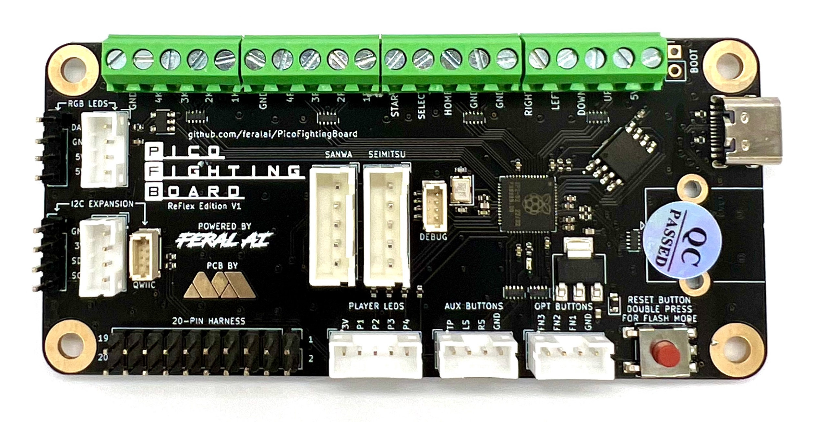

# Reflex Fighting Board

Open source PCB for arcade sticks using Raspberry Pi Pico's RP2040 microcontroller.

## Introduction

They say imitation is the highest form of flattery. If that's the case then the Brook line of arcade controller boards must be blushing beet red. The Reflex Fighting Board uses the same form factor and layout of the Brook PCBs to maintain compatibility with existing arcade stick cases, wiring harnesses, wire management accessories, etc.

The files for PCB production are in the [Releases](https://github.com/misteraddons/ReflexFightingBoard/tree/main/boards/Reflex_V1) section. The zip file contains the Gerber and drill files, which is all you'll need if you're soldering SMT components yourself. There are also `csv` files for the BOM (Bill of Materials) and component positioning for SMT assembly service.

I will also have premade boards periodically available for purchase at <https://misteraddons.com/collections/parts/products/reflex-encode-fighting-board>.

## Versions, Errata & Changelog

Reflex Encode V1.0:

-RGB LED voltage too low - voltage source moved to Vbus (before fuse) instead of +5V (after fuse)

-Pinout = PicoFightingBoard

Reflex Encode V1.1:

-Added USB A connector

-Added 5 pin USB header

-Pinout = GP2040

-Added turbo button

-Added turbo LED

-Added spinner header

-Error: Left and Right pins swapped compared to GP2040 pinout

-Error: TP+L3+R3 pinout incompatible with Brook cable

Reflex Encode V1.2:

-Fixed Left / Right pinout

-Fixed TP+L3+R3 pinout

## Firmware

The [GP2040](https://github.com/OpenStickCommunity/GP2040-CE) gamepad firmware for Pi Pico/RP2040 has a pre-configured build for use with the Reflex Fighting Board, providing support for XInput (PC, Android, Raspberry Pi, etc.), DInput (PC/PS3) and Nintendo Switch. [Go to the releases](https://github.com/OpenStickCommunity/GP2040-CE/releases) and download the `GP2040-CE_X.X.X_PicoFightingBoard.uf2`. To flash:

1. Unplug your Reflex Fighting Board.
1. Hold the BOOTSEL button on the Pico and plug into your computer. A new removable drive named `RPI-RP2` should appear in your file explorer.
1. Drag and drop the `GP2040-CE_X.X.X_PicoFightingBoard.uf2` file into the removable drive. This will flash the board.
1. The board should now be running the GP2040 firmware and should appear as a controller on your computer.

## Modification

If you want to modify the PCB layout you'll need the free [KiCad software](https://www.kicad.org/download/) installed. KiCad 6.x/7.x was used for these instructions.

## Support

If you would like to discuss and issues or features with the Reflex Fighting Board, please join the [OpenStick GP2040-CE Discord server](https://discord.gg/k2pxhke7q8) or the [MiSTer Addons Discord server](https://discord.gg/PtUFHtzuYD).

## Contributions

Want to help improve the Reflex Fighting Board? There are a bunch of ways to contribute!

### Pull Requests

Pull requests are welcome and encouraged for enhancements, fixes and documentation updates.
